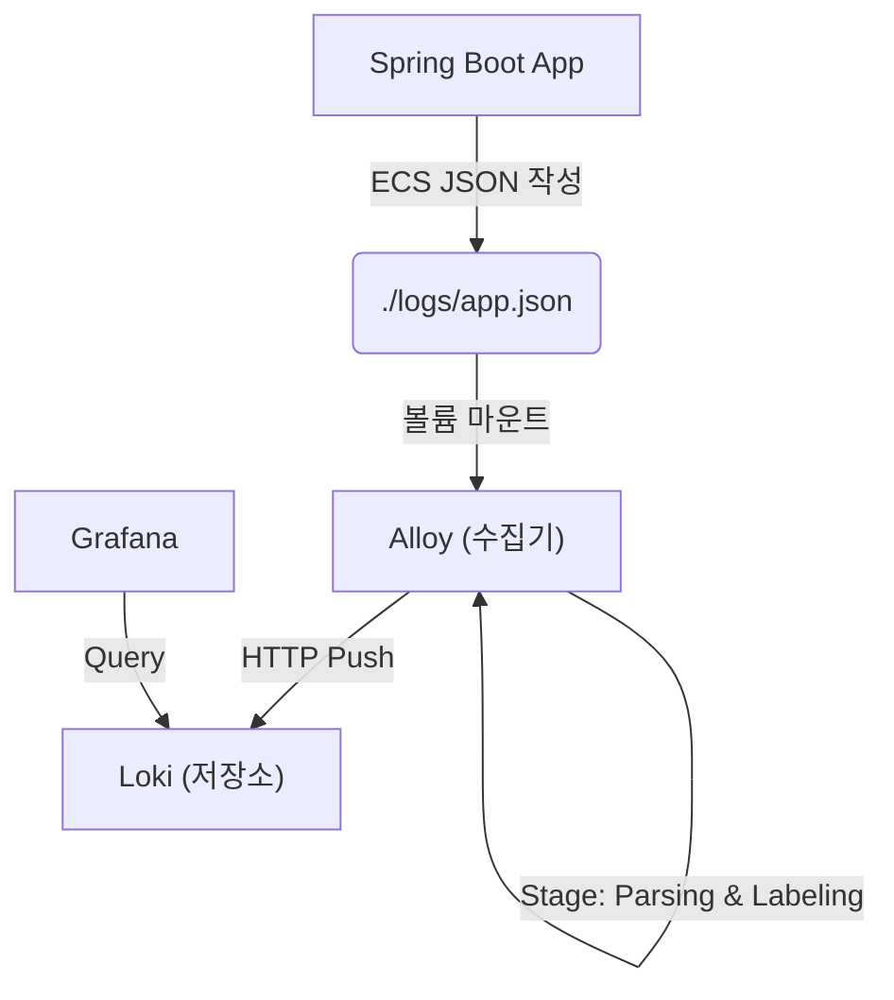

[[MDC]] 에서 만든 로그 시스템에서는 다음과 같은 문제가 존재한다.
`MDC` 는 `JVM` 내부에서만 동작하기에 서로 다른 서버 간의 호환이 안된다. 이 때문에 하나의 요청이 여러 서버를 거칠 때 로그를 추적하기가 너무 어렵다.

### Step 1. 서버 간 맥락 연결 - Header 이용하기
이를 극복할 수 있는 유일한 방법은 서버에서 외부와 소통할 때 사용하는 방식을 이용하는 것이다.
즉, `HTTP`를 이용한다.

이 때, `Body` 와 `Query Param` 을 이용하면 비즈니스 데이터에 메타 정보가 섞여서 지저분해진다. 그래서 메타 정보를 위한 공간인 `Header` 를 적극 활용한다.

`micrometer-tracing` 을 `Spring Boot 4.x` 와 함께 사용하면 아래와 같은 `W3C Trace Context 표준` 을 자동으로 `Header` 에 포함해준다. (이게 업계 표준이다!)

  **W3C Trace Context 표준:**
  ```
  traceparent: 00-0af7651916cd43dd8448eb211c80319c-b7ad6b7169203331-01
               ↑   ↑                                ↑                ↑
               버전 trace-id (32자리)                 span-id          flags
  ```


### Step 2. 로그 중앙 관리 - 과거의 시도들
흩어진 로그를 한 곳에서 보아야 추적이 쉽다. 과거에도 로그를 모으려고 별의별 시도를 다 했다.

- **공유 디스크** : Lock 없으면 충돌나고, Lock 걸면 성능 떨어진다. 하나 죽으면 다 죽는 SPOF 문제도 있다.
- **rsync 복사** : 실시간이 아니다. 새벽에 장애 터졌는데 로그는 1분 뒤에나 도착하면 피눈물 난다.
- **UDP syslog** : 패킷이 유실된다. "결제 실패인지 로그가 사라진 건지" 구분 안 되면 장애 분석은 포기해야 한다.

결국 좋은 로깅 시스템은 이래야 한다.
- **비동기 전송** : 내 앱 성능 갉아먹으면 안 된다.
- **실시간성** : 로그 찍히면 바로 볼 수 있어야 한다.
- **신뢰성** : 네트워크 좀 끊겨도 버퍼링했다가 재시도해야 한다.
- **구조화** : JSON처럼 기계가 읽기 좋아야 한다.

### Step 3. 전문 로그 에이전트와 Loki의 등장
  ```
  Logstash (2010~)     → 무겁다 (JVM 기반)
  Fluentd (2011~)      → 중간 (Ruby 기반)
  Filebeat (2015~)     → 가볍다 (Go 기반)
  Promtail (2018~)     → Loki 전용, 근데 2025년에 deprecated 된다고 함.
  Alloy (2024~)        → Promtail 후속작! OTel + Loki 통합 수집기 (이거 써야 함)
  ```

가장 유명한 건 `ELK`지만, `Loki` 가 훨씬 가볍다고 해서 비교해봤다.

| 구분 | ELK | Loki |
| :--- | :--- | :--- |
| **인덱싱** | 본문 전체 (겁나 무거움) | **라벨(메타데이터)만** |
| **철학** | "다 찾아줄게" | "필요한 것만 빠르게" |
| **리소스** | 무거움 | **가벼움** |
| **검색 방식** | 전문 검색 | 라벨로 필터링 → 본문 grep |

  **Loki LogQL의 핵심: 1차는 라벨로, 2차는 본문으로!**
  ```
  {service="order-service", level="ERROR"}  |=  "userId=12345"
  └─────────────────────────────────────┘     └─────────────┘
     라벨 필터 (인덱스 타서 빠름)                  본문 grep (속도 빠름)
  ```

| 메타데이터 | 라벨 적합? | 이유 |
| :--- | :--- | :--- |
| `service=order` | ✅ | 종류가 적음 |
| `level=ERROR` | ✅ | 고정된 값 |
| `trace_id=abc` | ❌ | **값 종류가 너무 많음 (Cardinality 폭발)** |

  > **중요:** `trace_id` 같은 고유값은 라벨로 만들면 Loki 서버 터진다. 본문에 두고 검색으로 찾는 게 맞다.

### Step 4. 표준화 — ECS와 OpenTelemetry
  **ECS (Elastic Common Schema):** 로그 필드 이름을 내 맘대로 정하지 말고 표준을 따르자. 벤더가 바뀌어도 도구가 호환된다.

  **OpenTelemetry (OTel):** 
  옛날엔 Zipkin, Jaeger 등등 파편화되어 있었는데 이제 `OpenTelemetry` 로 대통합됐다. CNCF의 사실상 업계 표준이다.

---

### Step 5. 우리가 만든 최종 아키텍처 (현대적 로깅)



---

### Step 6. 핵심 설정들 (복붙용)

#### `build.gradle.kts`
```kotlin
dependencies {
    // [1] 로그를 예쁜 JSON으로 (Alloy가 읽기 좋게)
    implementation("co.elastic.logging:logback-ecs-encoder:1.5.0")

    // [2] Tracing - Spring Boot 4.x는 OTel 기반이다!
    implementation("io.micrometer:micrometer-tracing-bridge-otel")
    implementation("org.springframework.boot:spring-boot-starter-opentelemetry")

    // [3] 비동기(@Async) 돌려도 traceId 안 끊기게 해준다
    implementation("io.micrometer:context-propagation")

    // [4] 기타 필수템
    implementation("org.springframework.boot:spring-boot-starter-web")
    implementation("org.springframework.boot:spring-boot-starter-actuator")
}
```

#### 2. `logback-spring.xml`
콘솔에는 사람이 보기 좋게 찍고, 파일에는 Alloy가 먹기 좋게 JSON(ECS)로.
```xml
<?xml version="1.0" encoding="UTF-8"?>  
<configuration>  
    <include resource="org/springframework/boot/logging/logback/defaults.xml"/>  
  
    <springProperty scope="context" name="appName" source="spring.application.name"/>  
  
    <!-- 1. 사람이 읽는 콘솔 (디버깅용) -->  
    <appender name="CONSOLE" class="ch.qos.logback.core.ConsoleAppender">  
        <encoder>  
            <pattern>%d{HH:mm:ss.SSS} %5p [${appName},%X{traceId:-},%X{spanId:-}] [%t] %-40.40logger{39} : %m%n  
            </pattern>  
        </encoder>  
    </appender>  
  
    <!-- 2. ECS JSON 파일 — Alloy가 수집할 파일! -->  
    <appender name="ECS_FILE" class="ch.qos.logback.core.rolling.RollingFileAppender">  
        <file>./logs/app.json</file>  
        <rollingPolicy class="ch.qos.logback.core.rolling.SizeAndTimeBasedRollingPolicy">  
            <fileNamePattern>./logs/app-%d{yyyy-MM-dd}.%i.json.gz</fileNamePattern>  
            <maxFileSize>100MB</maxFileSize>  
            <maxHistory>7</maxHistory>  
            <totalSizeCap>1GB</totalSizeCap>  
        </rollingPolicy>  
        <encoder class="co.elastic.logging.logback.EcsEncoder">  
            <serviceName>${appName}</serviceName>  
            <serviceVersion>0.0.1-SNAPSHOT</serviceVersion>  
            <includeMarkers>true</includeMarkers>  
            <includeOrigin>false</includeOrigin>  
        </encoder>  
    </appender>  
  
    <root level="INFO">  
        <appender-ref ref="CONSOLE"/>  
        <appender-ref ref="ECS_FILE"/>  
    </root>  
</configuration>
```

#### 3. `docker-compose.yml`
```yaml
version: "3.8"  
  
services:  
  loki:  
    image: grafana/loki:2.9.4  
    container_name: loki  
    ports:  
      - "3100:3100"  
    command: -config.file=/etc/loki/local-config.yaml  
    volumes:  
      - ./loki/config.yaml:/etc/loki/local-config.yaml:ro  
      - loki-data:/loki  
  
  alloy:  
    image: grafana/alloy:latest  
    container_name: alloy  
    ports:  
      - "12345:12345"  
    volumes:  
      - ./alloy/config.alloy:/etc/alloy/config.alloy:ro  
      - ./logs:/var/log/app:ro      # 호스트의 ./logs 디렉토리를 컨테이너에 마운트  
    command:  
      - run  
      - --server.http.listen-addr=0.0.0.0:12345  
      - --storage.path=/var/lib/alloy/data  
      - /etc/alloy/config.alloy  
    depends_on:  
      - loki  
  
  grafana:  
    image: grafana/grafana:10.2.3  
    container_name: grafana  
    ports:  
      - "3000:3000"  
    environment:  
      - GF_AUTH_ANONYMOUS_ENABLED=true  
      - GF_AUTH_ANONYMOUS_ORG_ROLE=Admin  
    volumes:  
      - grafana-data:/var/lib/grafana  
    depends_on:  
      - loki  
  
volumes:  
  loki-data:  
  grafana-data:
```

#### 4. `alloy/config.alloy`
`Alloy` 가 어떻게 동작할 지 설정
```alloy
// ===========================================  
// ① 어떤 파일을 수집할지 매칭  
// ===========================================  
local.file_match "app_logs" {  
path_targets = [  
  {  
    __path__ = "/var/log/app/*.json",  
    service  = "order-service",  
    env      = "local",  
  },  
]  
}  
  
// ===========================================  
// ② 파일을 tail로 읽기 (실시간)  
// ===========================================  
loki.source.file "app_logs" {  
targets    = local.file_match.app_logs.targets  
forward_to = [loki.process.parse_ecs.receiver]  
}  
  
// ===========================================  
// ③ ECS JSON 파싱 + 라벨 추출  
// ===========================================  
loki.process "parse_ecs" {  
forward_to = [loki.write.local_loki.receiver]  
  
// (3-1) JSON 필드 추출 — ECS는 점(.) 들어간 필드명을 씀  
stage.json {  
  expressions = {  
    level       = "\"log.level\"",  
    service     = "\"service.name\"",  
    logger_name = "\"log.logger\"",  
    trace_id    = "\"trace.id\"",  
    span_id     = "\"span.id\"",  
  }  
}  
  
// (3-2) 라벨로 등록할 것만 선별 — Cardinality 폭발 방지!  
stage.labels {  
  values = {  
    level   = "",  
    service = "",  
  }  
}  
  
// (3-3) timestamp 매핑 — ECS의 @timestamp를 Loki의 timestamp로  
stage.timestamp {  
  source = "@timestamp"  
  format = "RFC3339Nano"  
}  
}  
  
// ===========================================  
// ④ Loki로 push  
// ===========================================  
loki.write "local_loki" {  
endpoint {  
  url = "http://loki:3100/loki/api/v1/push"  
}  
}
```
