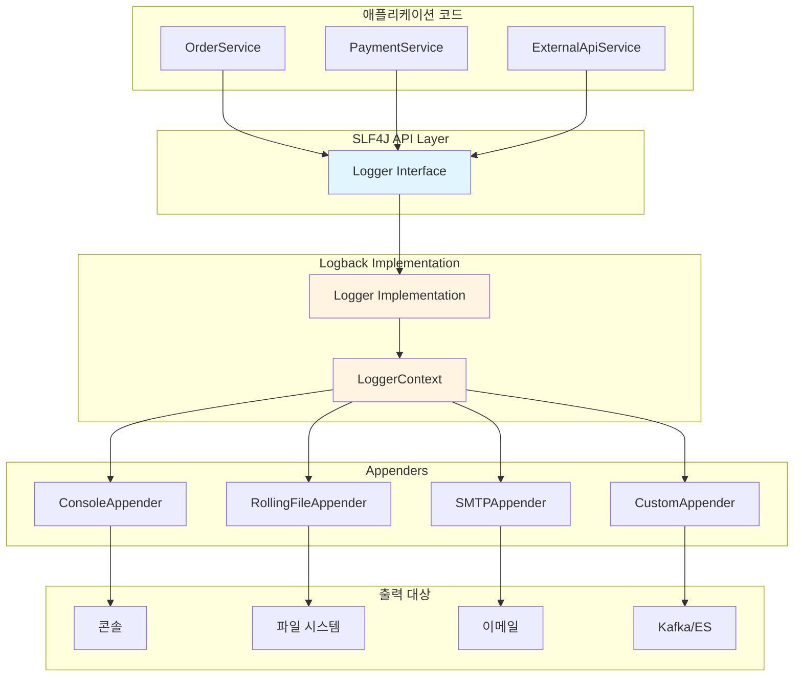
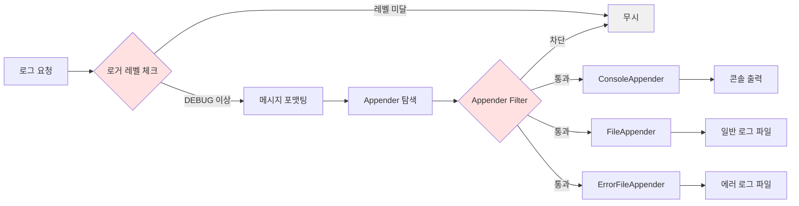
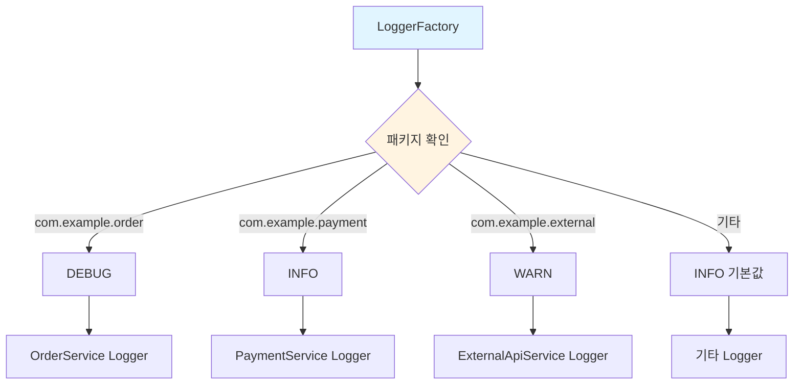
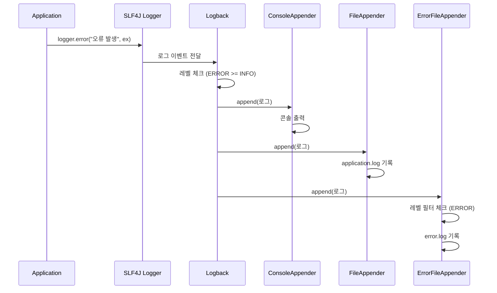

[[Logging, 좋은 로깅이란 무엇인가]]에서 만든 기능들을 직접 구현하는 대신, 검증된 라이브러리를 사용하자.

### 의존성 추가 (Gradle)
```gradle
dependencies {
    implementation 'org.slf4j:slf4j-api:2.0.9'
    implementation 'ch.qos.logback:logback-classic:1.4.11'
}
```

**Spring Boot** 는 이미 `SLF4J` 와 `Logback` 을 포함하고 있다.
```gradle
dependencies {
    implementation 'org.springframework.boot:spring-boot-starter'
    // spring-boot-starter에 이미 slf4j와 logback이 포함되어 있음
}
```

### 기본 사용법
```java
import org.slf4j.Logger;
import org.slf4j.LoggerFactory;

public class OrderService {
    private static final Logger logger = LoggerFactory.getLogger(OrderService.class);
    
    public void order(String userId, Long productId, int quantity) {
        logger.info("주문 시작: userId={}, productId={}", userId, productId);
        logger.debug("주문 수량: {}", quantity);
        
        try {
            processOrder(userId, productId, quantity);
            logger.info("주문 완료");
        } catch (InsufficientStockException e) {
            logger.error("재고 부족으로 주문 실패: userId={}, productId={}", 
                        userId, productId, e);
        } catch (Exception e) {
            logger.error("예상치 못한 오류 발생", e);
        }
    }
}
```

---

### Logback 설정 (logback.xml)

`src/main/resources/logback.xml` 파일 생성:

```xml
<?xml version="1.0" encoding="UTF-8"?>
<configuration>
    
    <!-- 콘솔 출력 -->
    <appender name="CONSOLE" class="ch.qos.logback.core.ConsoleAppender">
        <encoder>
            <pattern>%d{yyyy-MM-dd HH:mm:ss.SSS} [%thread] %-5level %logger{36} - %msg%n</pattern>
        </encoder>
    </appender>
    
    <!-- 파일 출력 (Rolling) -->
    <appender name="FILE" class="ch.qos.logback.core.rolling.RollingFileAppender">
        <file>/var/log/myapp/application.log</file>
        <rollingPolicy class="ch.qos.logback.core.rolling.TimeBasedRollingPolicy">
            <!-- 일별 롤링 -->
            <fileNamePattern>/var/log/myapp/application.%d{yyyy-MM-dd}.log</fileNamePattern>
            <!-- 30일 보관 -->
            <maxHistory>30</maxHistory>
            <!-- 전체 로그 파일 최대 크기 -->
            <totalSizeCap>10GB</totalSizeCap>
        </rollingPolicy>
        <encoder>
            <pattern>%d{yyyy-MM-dd HH:mm:ss.SSS} [%thread] %-5level %logger{36} - %msg%n</pattern>
        </encoder>
    </appender>
    
    <!-- 에러 전용 파일 -->
    <appender name="ERROR_FILE" class="ch.qos.logback.core.rolling.RollingFileAppender">
        <file>/var/log/myapp/error.log</file>
        <filter class="ch.qos.logback.classic.filter.LevelFilter">
            <level>ERROR</level>
            <onMatch>ACCEPT</onMatch>
            <onMismatch>DENY</onMismatch>
        </filter>
        <rollingPolicy class="ch.qos.logback.core.rolling.TimeBasedRollingPolicy">
            <fileNamePattern>/var/log/myapp/error.%d{yyyy-MM-dd}.log</fileNamePattern>
            <maxHistory>90</maxHistory>
        </rollingPolicy>
        <encoder>
            <pattern>%d{yyyy-MM-dd HH:mm:ss.SSS} [%thread] %-5level %logger{36} - %msg%n</pattern>
        </encoder>
    </appender>
    
    <!-- 패키지별 로그 레벨 설정 -->
    <logger name="com.example.order" level="DEBUG"/>
    <logger name="com.example.payment" level="INFO"/>
    <logger name="com.example.external" level="WARN"/>
    
    <!-- Hibernate SQL 로그 (개발 환경) -->
    <logger name="org.hibernate.SQL" level="DEBUG"/>
    <logger name="org.hibernate.type.descriptor.sql.BasicBinder" level="TRACE"/>
    
    <!-- 루트 로거 -->
    <root level="INFO">
        <appender-ref ref="CONSOLE"/>
        <appender-ref ref="FILE"/>
        <appender-ref ref="ERROR_FILE"/>
    </root>
    
</configuration>
```

---

### Spring Boot application.yml 설정

```yaml
logging:
  level:
    root: INFO
    com.example.order: DEBUG
    com.example.payment: INFO
    org.hibernate.SQL: DEBUG
  pattern:
    console: "%d{yyyy-MM-dd HH:mm:ss} - %msg%n"
    file: "%d{yyyy-MM-dd HH:mm:ss} [%thread] %-5level %logger{36} - %msg%n"
  file:
    name: /var/log/myapp/application.log
  logback:
    rollingpolicy:
      max-file-size: 10MB
      max-history: 30
```

---

## 아키텍처 시각화



## 로그 레벨별 흐름



## 패키지별 로그 레벨 관리



## Appender 처리 흐름



---

## 주요 포인트 정리

1. **SLF4J는 인터페이스, Logback은 구현체**
    
    - SLF4J API만 사용하면 구현체 교체 가능 (Logback ↔ Log4j2)
2. **로그 레벨 순서**
    
    - TRACE < DEBUG < INFO < WARN < ERROR
    - INFO 설정 시: INFO, WARN, ERROR만 출력
3. **성능 최적화**
    
    - 조건부 로깅: `if (logger.isDebugEnabled()) { logger.debug(...) }`
    - 파라미터 바인딩: `logger.info("userId={}", userId)` (문자열 연결 X)
4. **운영 환경 권장 설정**
    
    - 루트 레벨: INFO
    - 핵심 비즈니스 패키지: DEBUG
    - 외부 라이브러리: WARN
    - 에러 로그는 별도 파일 + 알림 연동

참고 자료:

- https://www.slf4j.org/manual.html
- https://logback.qos.ch/manual/architecture.html